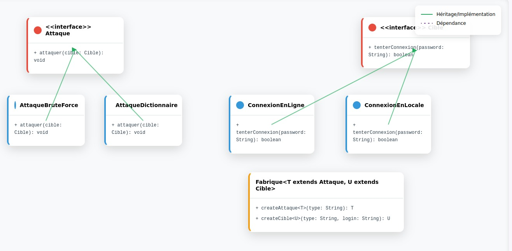

# Projet de DESIGN PATTERNS - PASSWORD CRACKER

## Introduction
      Ce projet utilise plusieurs patrons de conception pour rendre l'architecture logicielle plus flexible et modulaire. L'objectif est de simuler des attaques de force brute et par dictionnaire, ainsi que de tseter de cracker le mot de passe via des cibles locales ou en ligne.


## Diagramme de Classes
    Voici le diagramme de classes correspondant à l'architecture de ce projet. Il montre les relations entre les interfaces, les classes concrètes, et les patrons de conception utilisés.



## Patrons de Conception

### Patron de Conception Fabrique (Factory)
      Le **patron Fabrique** est utilisé pour créer dynamiquement des objets liés aux attaques (comme celles par brute force ou dictionnaire) ainsi que des objets représentant les cibles (locale ou en ligne), selon les paramètres fournis par l'utilisateur. Ce modèle permet de générer ces objets sans avoir à se soucier de leurs détails d'implémentation.
      - **Factory Method** : Cette méthode permet de créer des objets de types spécifiques (attaques et cibles) en fonction du type demandé. Elle sépare la logique de création d'objets et permet d'utiliser différentes classes d'attaques et de cibles, sans avoir à préciser directement la classe exacte lors de l'appel.
      

### Patron de Conception Strategy
      Le **patron Strategy** permet de définir plusieurs algorithmes (par exemple, différentes méthodes d'attaque) et de les rendre interchangeables, sans avoir à modifier la classe qui les utilise. Dans ce cas, chaque méthode d'attaque (par brute force, par dictionnaire) représente une stratégie distincte.

#### Justification de l'utilisation du patron Strategy
      Ce patron permet de sélectionner l'algorithme d'attaque à utiliser au moment de l'exécution, sans avoir à modifier le code central de l'application. Cela améliore la flexibilité du code, le rendant plus facile à maintenir et à étendre. Chaque stratégie est indépendante, ce qui permet de les modifier ou d'en ajouter de nouvelles sans impacter les autres parties du programme.


## Documentation Java
Pour une compréhension plus détaillée de chaque classe, méthode et attribut, veuillez consulter la [documentation Java générée](https://papesocendiaye.github.io/PASSWORD-CRACKER/doc/).

## Installation

1. Clonez ce repository :
   ```bash
   git clone <[url_du_repository](https://github.com/papesocendiaye/PASSWORD-CRACKER.git)>
2. executer :
    ```bash
   git clone <url_du_repository>
